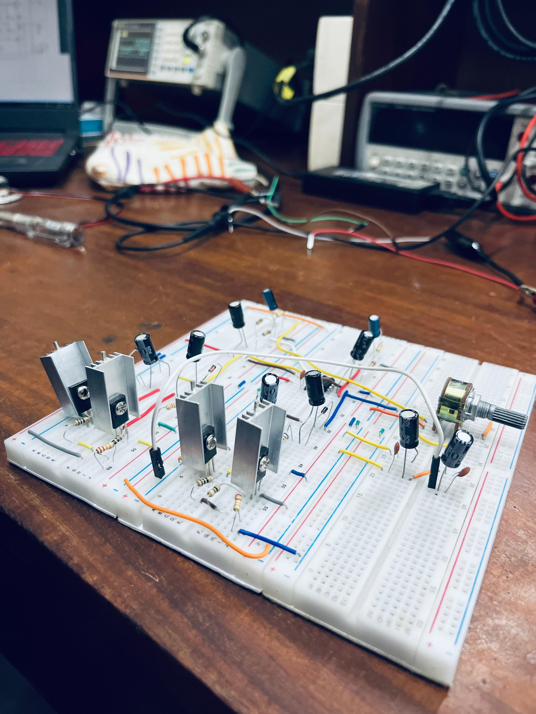

# 🎧 Class AB Audio Amplifier

A stereo headphone amplifier project designed as part of the **EN2111: Electronic Circuit Design** course at the University of Moratuwa. This circuit demonstrates practical analog design with low distortion and stable performance across the full audio frequency range.

  

## 🔧 Features

- **Volume Controller** using a simple RC voltage divider
- **Pre-Amplifier** stage with NE5532 op-amp (Gain = 23)
- **Class AB Push-Pull Power Amplifier** using BD139 and BD140
- **Bootstrap capacitors** for biasing stability
- **DC decoupling** and **power supply noise filtering**
- **Consistent 28 dB gain** across 10 Hz to 30 kHz

## 🔍 Circuit Overview

The amplifier has three main stages:

1. **Volume Controller** – Adjusts the amplitude of the input signal.
2. **Pre-Amplifier** – Amplifies low-level signals to line level.
3. **Class AB Power Amplifier** – Drives 16 Ω headphone loads efficiently.

## 📈 Performance Highlights

- **Gain**: ~28 dB flat across audio range
- **Slew Rate Requirement**: ≥1.75 V/µs
- **Power Efficiency**: ~62.65%
- **Bandwidth**: ~434.78 kHz (for GBWP = 10 MHz, Gain = 23)
- **Output Power**: ~1 W into 16 Ω load

### 🔬 Frequency Response

| Frequency (Hz) | Output (V) | Gain (dB) |
|----------------|------------|-----------|
| 10             | 8.8        | 24.91     |
| 100            | 12.4       | 27.89     |
| 1k             | 12.4       | 27.89     |
| 10k            | 12.6       | 28.03     |
| 20k            | 12.6       | 28.03     |

## 🧪 Simulations

- Simulated using **Proteus**
- Verified time-domain waveforms
- FFT analysis shows **minimal harmonic distortion**

## 📦 Components

- **Op-Amp**: NE5532 – Low-noise, high GBWP
- **Transistors**: BD139 (NPN), BD140 (PNP)
- **Capacitors**: Ceramic for power filtering
- **Diodes**: For Class AB biasing

## 👥 Team

- **Manuri Boralugoda** ([GitHub](https://github.com/msboralugoda))
- Jayasekara S.P.R
- Munavvar M.A.A
- Ransika L.G.C

